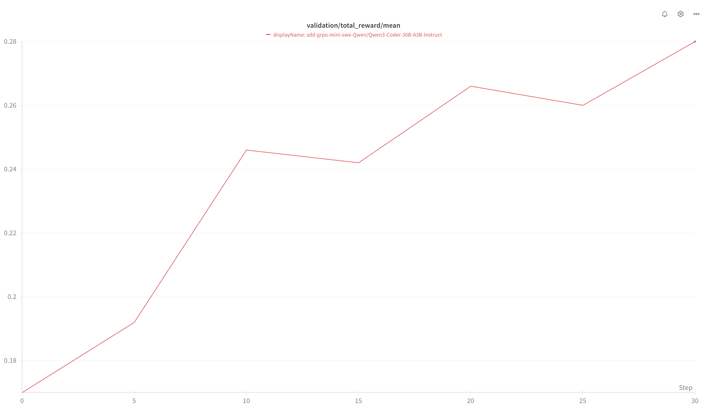

# Mini-SWE-Agent Environment

A NeMo Gym responses API agent that integrates the [Mini-SWE-Agent](https://github.com/SWE-agent/mini-swe-agent) harness for evaluating language models on software engineering tasks using the SWE-Bench dataset.

## Table of Content
- [Mini-SWE-Agent Environment](#mini-swe-agent-environment)
  - [Table of Content](#table-of-content)
  - [Overview](#overview)
  - [Reward Profiling](#reward-profiling)
    - [Model - Qwen/Qwen3-Coder-30B-A3B-Instruct](#model---qwenqwen3-coder-30b-a3b-instruct)
  - [Dataset Information](#dataset-information)
  - [Configuration](#configuration)
    - [Agent Configuration](#agent-configuration)
  - [Usage](#usage)
    - [Download SWE-Gym Images](#download-swe-gym-images)
    - [Server](#server)
    - [Trajectory Collection Script](#trajectory-collection-script)
  - [Contributing](#contributing)
  - [Licensing Information](#licensing-information)
    - [Dependencies](#dependencies)

## Overview

The Mini-SWE-Agent environment provides an interface for training models on solving real-world software engineering problems. 
It leverages the SWE-Gym dataset of GitHub issues and uses containerized environments (Docker/Singularity) to execute code modifications and validate solutions.

## Reward Profiling

### Model - Qwen/Qwen3-Coder-30B-A3B-Instruct
```md
Accuracy: 0.10
Resolved: 276
Total Instances: 2401
Average Turns: 88
```
## Dataset Information

- Training data - [SWE-Gym/SWE-Gym](https://huggingface.co/datasets/SWE-Gym/SWE-Gym) contains 2438 instances sourced from 11 Python repos, following SWE-Bench data collection procedure.
- Validation data - [princeton-nlp/SWE-bench_Verified](https://huggingface.co/datasets/princeton-nlp/SWE-bench_Verified) SWE-bench Verified is a subset of 500 samples from the SWE-bench test set, which have been human-validated for quality. SWE-bench is a dataset that tests systems’ ability to solve GitHub issues automatically. See this post for more details on the human-validation process.

## Configuration

### Agent Configuration 

Path - `resources_servers/mini_swe_resource/configs/mini_swe_resource.yaml
```yaml
mini_swe_resource_resources_server:
  resources_servers:
    mini_swe_resource:
      entrypoint: app.py
      domain: coding
mini_swe_simple_agent:
  responses_api_agents:
    mini_swe_agent:
      entrypoint: app.py
      resources_server:
        type: resources_servers
        name: mini_swe_resource_resources_server
      model_server:
        type: responses_api_models
        name: openai_model
      datasets:
      - name: train
        type: train
        jsonl_fpath: resources_servers/mini_swe_resource/data/train.jsonl
        gitlab_identifier:
          dataset_name: mini_swe_agent
          version: 0.0.1
          artifact_fpath: train.jsonl
        license: MIT
      - name: validation
        type: validation
        jsonl_fpath: resources_servers/mini_swe_resource/data/validation.jsonl
        gitlab_identifier:
          dataset_name: mini_swe_agent
          version: 0.0.1
          artifact_fpath: validation.jsonl
        license: MIT
      - name: example
        type: example
        jsonl_fpath: resources_servers/mini_swe_resource/data/example.jsonl
      concurrency: 16 # number of instances to run concurrently
      env: singularity 
      cache_dir_template: ??? # The cache dir path where singularity images are stored
      run_golden: False # If set to true, run the golden patch
      step_timeout: 600 # Timeout for each agent step
      eval_timeout: 1800 # Timeout for running the evaluation (unit tests)
      skip_if_exists: False # If set to true, skip all instances already processed for the model
      collapse_limit: 3 # Warn the agent if the same command if repeated collapse_limit times
```


## Usage

### Download SWE-Gym Images

For how to download images and convert to .sif, you can refer to https://github.com/NVIDIA/NeMo-Skills/blob/main/nemo_skills/dataset/swe-bench/dump_images.py

### Server

```bash
# Download swe-gym data
ng_download_dataset_from_gitlab \
            +dataset_name=mini_swe_agent \
            +version=0.0.1 \
            +artifact_fpath=train.jsonl \
            +output_fpath=data/train.jsonl

# Start server
CONFIG_PATHS="resources_servers/mini_swe_resource/configs/mini_swe_resource.yaml,responses_api_models/openai_model/configs/openai_model.yaml"
ng_run +config_paths=[$CONFIG_PATHS] \
        '+mini_swe_simple_agent.responses_api_agents.mini_swe_agent.cache_dir_template=/path/to/images/xingyaoww_sweb.eval.x86_64.\{instance_id\}.sif' \
        +mini_swe_simple_agent.responses_api_agents.mini_swe_agent.run_golden=False \
        +mini_swe_simple_agent.responses_api_agents.mini_swe_agent.skip_if_exists=True \
        +mini_swe_simple_agent.responses_api_agents.mini_swe_agent.concurrency=16 \
        +mini_swe_simple_agent.responses_api_agents.mini_swe_agent.step_timeout=300 \
        +mini_swe_simple_agent.responses_api_agents.mini_swe_agent.eval_timeout=900 &

# Collect rollouts
ng_collect_rollouts +agent_name=mini_swe_simple_agent \
            +input_jsonl_fpath=data/train.jsonl \
            +output_jsonl_fpath=results/mini_swe_agent_swe_gym.jsonl

# View trajectories
ng_viewer +jsonl_fpath=results/mini_swe_agent_swe_gym.jsonl
```

### Training Setup and Results

**Model:** Qwen/Qwen3-Coder-30B-A3B-Instruct  
**Framework:** [NemoRL](https://github.com/NVIDIA-NeMo/RL) \
**Num nodes:** 16  
**Num prompts per step:** 32  
**Num rollouts per step:** 16 \
**Validation** - SWEBench Verified on Mini-SWE-Agent



**Note - NemoRL changes for installing Singularity on all nodes.**

```bash
read -r -d '' SETUP_COMMAND <<EOF
apt-get update && apt-get install -y git build-essential gcc
apt install -y wget && \
cd /tmp && \
wget https://github.com/apptainer/apptainer/releases/download/v1.3.1/apptainer_1.3.1_amd64.deb && \
apt install -y ./apptainer_1.3.1_amd64.deb && \
ln -sf /usr/bin/apptainer /usr/bin/singularity
cd ${REPO_LOCATION}
EOF

export SETUP_COMMAND
```

```diff
diff --git a/ray.sub b/ray.sub
index 9b4feb11..f765a609 100644
--- a/ray.sub
+++ b/ray.sub
@@ -50,6 +50,7 @@ maybe_gres_arg() {
 CONTAINER=$CONTAINER
 MOUNTS=$MOUNTS
 COMMAND=${COMMAND:-}  # This is a script relative to the SLURM_SUBMIT_DIR. If left empty, it will leave the cluster idle after it's brought up.
+SETUP_COMMAND=${SETUP_COMMAND:-}  # Setup commands to run on all nodes before starting Ray
 ########################################################
 # Ports for all nodes (should be odd numbers since we place head/worker[0] on the same node) so all workers get the odd ports, but the head will get +1 the ports
 NODE_MANAGER_PORT=${NODE_MANAGER_PORT:-53001}
@@ -293,6 +294,7 @@ chmod +x /launch-head.sh
 
 count=0
 while [[ \$count -lt $num_retries ]]; do
+  $SETUP_COMMAND
   bash /launch-head.sh
   count=\$((count+1))
   echo "Head node failed \$count/$num_retries times, restarting in 5 seconds..."
@@ -305,6 +307,7 @@ EOF
 srun $COMMON_SRUN_ARGS --container-name=ray-head --nodes=1 --ntasks=1 --cpus-per-task=$CPUS_PER_WORKER -w "$head_node" -o $LOG_DIR/ray-head.log bash -x -c "$head_cmd" &
 SRUN_PIDS["ray-head"]=$!
 
+sleep 100s
 NUM_ACTORS=$((GPUS_PER_NODE * SLURM_JOB_NUM_NODES))
 
 # Start Ray worker nodes
@@ -392,6 +395,7 @@ EOFINNER
 
 count=0
 while [[ \$count -lt $num_retries ]]; do
+  $SETUP_COMMAND
   bash /launch-worker.sh
   count=\$((count+1))
   echo "Worker failed \$count/$num_retries times, restarting in 5 seconds..."

```

## Contributing

Please refer to the main NeMo Gym documentation for contributing guidelines.

## Licensing Information

- **Code**: Apache 2.0
- **SWE-GYM**: MIT

### Dependencies
- **nemo_gym**: Apache 2.0
- **mini-swe-agent**: MIT
- **SWE-Bench-Package**: MIT
